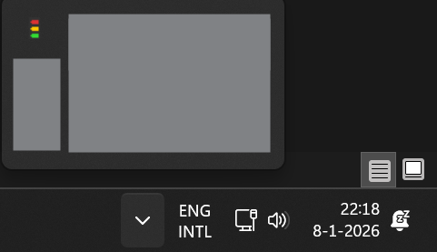
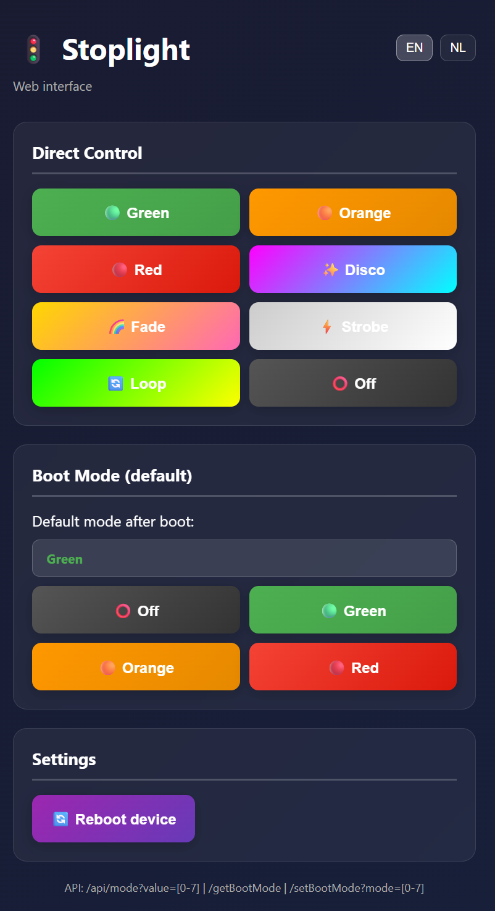

# Stoplight
ESP32-S3 Zero traffic-light with serial and web API, plus a PowerShell WPF GUI.


## Hardware
- Board: ESP32-S3 Zero (tested at 115200 baud)
- LEDs: 3x WS2812/NeoPixel on GPIO 8, VCC 5V, GND common
- Button: Momentary button to GPIO 7 and GND (INPUT_PULLUP). Long press (>10s) triggers Wi-Fi reset/config portal, short press cycles modes.
- Power: 5V for LEDs, USB-C for ESP32 (or a single 5V rail if sized for LED current)
- 3D Model: [Traffic Light Housing on Makerworld](https://makerworld.com/nl/models/1208760-traffic-light?from=search#profileId-2071991) with custom ESP32 S3 Zero base attached.

## Firmware (Arduino)
- 8 modes: 0=Off, 1=Green, 2=Orange, 3=Red, 4=Disco, 5=Fade, 6=Strobe (white), 7=Loop (green→orange→red)
- Boot mode persisted in NVS (`boot_mode`)
- Serial API (115200 baud) for local control
- Web API + simple web UI when Wi-Fi is connected
- Wi-Fi Manager: auto-connect to stored network; long-press button (>10s) clears Wi-Fi and launches config portal `Stoplicht-Setup`
- LED animations run on a dedicated FreeRTOS task (core 0) with mutex protection

### Build & flash
Required libraries: `Adafruit_NeoPixel`, `WiFiManager`, `Preferences` (built-in), `WebServer` (ESP32 core).

Example compile/upload (arduino-cli):
```bash
arduino-cli compile --fqbn "esp32:esp32:esp32s3:FlashMode=qio,FlashSize=4M,CDCOnBoot=cdc" --upload --port COM5 .
```
Adjust board options/port to your setup; CDC-on-boot can help with serial logging.

## Serial API (USB/COM)
- Baud: 115200, newline-terminated commands.
- Commands:
	- `mode:<0-7>` → `[ACK] mode:<x>` then `[OK] Mode set` or `[ERR] Mode 0-7 expected`
	- `status` → `[DATA] mode=<n>|wifi=<0|1>`
	- `ping` → `[PONG]`
	- `help` → `[DATA] Commands: mode:0-7, status, ping, help`

## Web API
- `GET /api/mode?value=<0-7>` → `{"status":"ok","mode":n}` (400 on invalid value)
- `GET /getBootMode` → `{"mode":n}`
- `GET /setBootMode?mode=<0-7>` → `{"success":true,"mode":n}` (400 on invalid/missing)
- `GET /reboot` → `{"success":true,"message":"Rebooting..."}`
- `GET /` serves the web UI (buttons for modes, boot mode, reboot)

## PowerShell GUI
Location: `Stoplight-Control.ps1` with launcher `Start-Stoplight.bat` (hides console).

Features:
- Dual transport: COM (serial) or Web API
- Connection test before switching modes
- Control buttons for all 8 modes
- Set boot mode (0-3) and reboot device
- Minimize to system tray; custom stoplight icon
- Persists last COM port and Web API URL in `stoplight-config.json`

Usage:
1) Run `Start-Stoplight.bat` in the project folder.
2) Enter COM port (e.g., `COM5`) or Web API base URL (e.g., `http://192.168.1.100`).
3) Click **COM Mode** or **Web Mode** to test and select the transport.
4) Use the mode buttons (Off/Green/Orange/Red/Disco/Fade/Strobe/Loop) or set boot mode and reboot.
5) Minimize to tray; double-click the tray icon to restore. Settings auto-save on change.

### Example screenshots
- System tray icon preview (Windows taskbar): 
- PowerShell WPF GUI (desktop app): 
- Web interface (EN/NL toggle shown): 

## Button behavior (device)
- Short press: advance to next mode (0→1→2→...→7→0)
- Long press (>10s): clear Wi-Fi credentials and start config portal on reboot

## Default pins (adjust in code if needed)
- `LED_PIN = 8`
- `LED_COUNT = 3`
- `BUTTON_PIN = 7`
